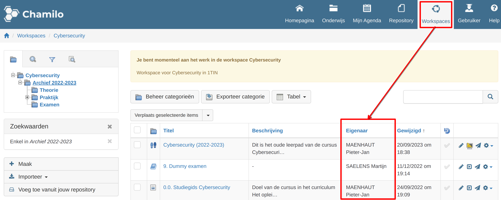
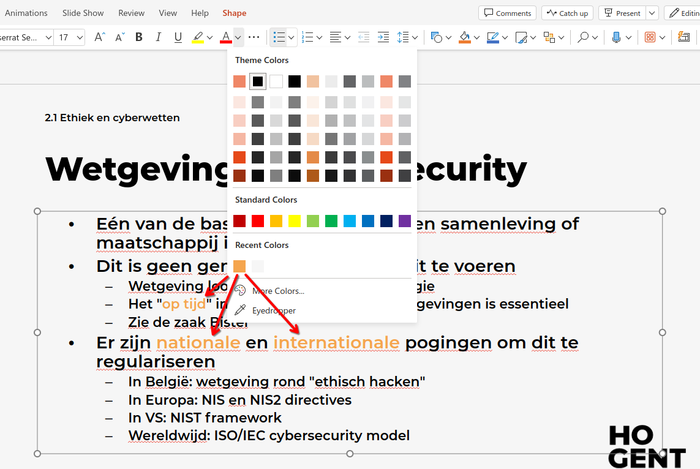
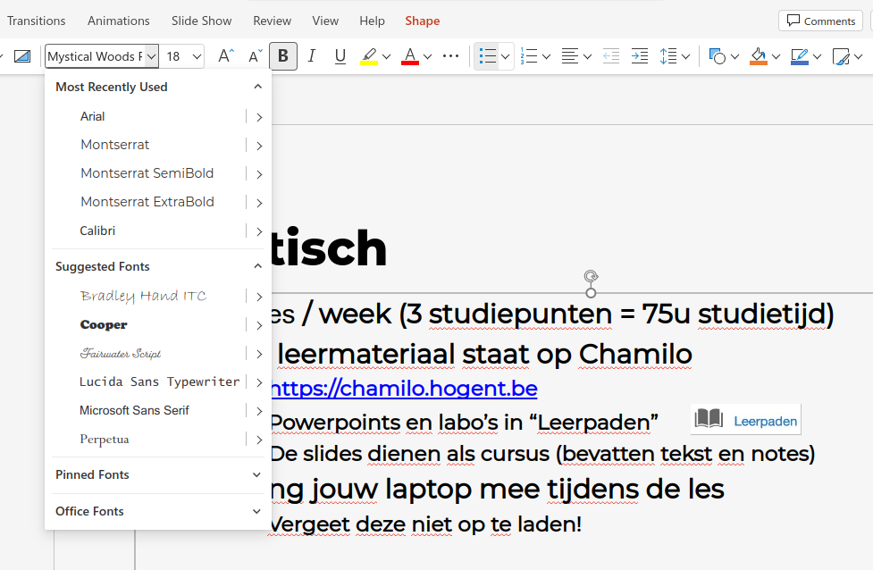
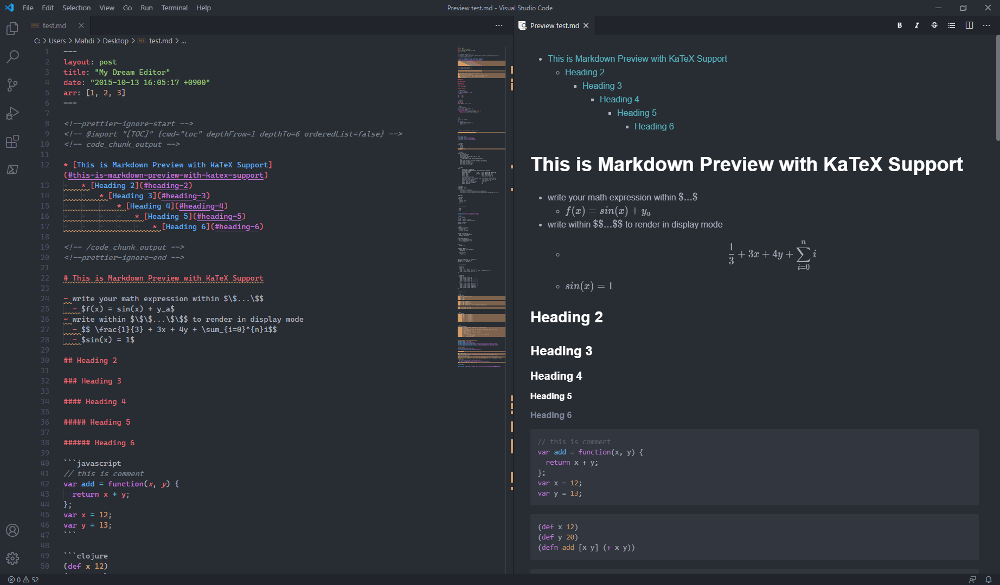

# Van MarkDown naar cursus

The easy way: geen Bash, Powershell, LaTeX, HTML & CSS, ... .

## Probleemstelling

Bij het herwerken van de cursus voor Cybersecurity 1 kwamen onderstaande volgende frustraties naar boven.

Leerpaden op Chamilo hebben enkele tekortkomingen:

-   Permissies zorgen vaak voor verwarring.

    -   Wie kan iets bewerken, (on)zichtbaar maken, ... ?
    -   Wat gebeurt er met objecten als iemand zijn Chamilo account wordt verwijderd?

    

-   Opmaak in berichten op het leerpad is niet altijd evident. Daarnaast is deze niet altijd consequent. Je kan wel HTML gebruiken, maar de gegenereerde HTML code is niet kwaliteitsvol.

Powerpoints hebben ook enkele tekortkomingen:

-   De opmaak met het HOGENT-sjabloon is een ramp om consequent te krijgen:

    -   Tekstkleur voor benadrukken: welk soort oranje gebruik je? HOGENT heeft een bepaalde kleur, maar meesten kiezen er eentje uit de color picker van Office.

        

    -   Welk lettertype gebruik je? Montserrat, Montserrat Bold, Montserrat Semi, ... ? Sommige worden in nog eens in bold gezet, andere niet.

        

    -   Het lettertype van notities aanpassen is vaak tricky, meestal valt deze terug op Arial. Daarnaast worden links niet altijd aanklikbaar in notities en is het toevoegen van meer opmaak zoals bullet points niet altijd evident.
    -   De autoresize wil niet altijd meewerken: soms staat deze vast op een bepaalde grootte van lettertype, soms niet.
    -   De opmaak verschilt ook tussen de offline powerpoint applicatie en de online editor.

-   Als je foto's hebt ingevoegd en je wil deze later ergens anders gebruiken, dan moet je ze opnieuw opzoeken of uit de powerpoint halen. Ervaring leert dat bij de laatste optie de kwaliteit ferm verminderd is van het origineel.
-   Code toevoegen op powerpoint is ook niet evident: maak je een screenshot of voeg je het toe als tekst? Er is geen optie voor syntax highlighting.
-   Als je powerpoints update, moet je ze opnieuw op Chamilo uploaden.
-   Embedden van video of audio is steeds een Russische roulette of het zal werken of niet.
-   Powerpoint is niet cross-platform.
-   OneDrive is geen backup! We hebben al eens voorgehad dat collega van een ander vak onze cursus (vermoedelijk per ongeluk) had versleept naar een andere map. Hierdoor vreesden we even alles kwijtgespeeld te raken. Ondanks dat de IT-dienst dit waarschijnlijk wel zou teruggevonden kunnen hebben, is het geen goed idee om enkel hierop te vertrouwen. Daarnaast is een versiebeheer altijd handig om terug in de tijd te gaan kijken.

## Voordelen van MarkDown

-   De syntax is zeer eenvoudig en ook alom gekend door IT'ers. Het is eigenlijk een gewoon tekstbestand waarbij sommige karakters extra betekenis krijgen voor o.a. opmaak (**vet**, _cursief_, ...), titels, lijsten, afbeeldingen, codefragmenten (met ondersteuning voor syntax highlighting), quotes, wiskundige LaTeX formules, ... .
-   Het wordt op heel veel plaatsen gebruikt: Microsoft Teams, GitHub, GitLab, Discord, Element, Reddit, online forums, chatprogramma's, documentatietools, ... .
-   Je hebt enkel een teksteditor naar keuze nodig om MarkDown bestanden te maken of te wijzigen.

    -   :bulb: VSCode heeft zelfs de mogelijkheid voor een live preview.

        -   

-   Aangezien het gewoon tekst is, kan je het perfect combineren met Git (en dus GitHub, GitLab, ...). Dit geeft zeer veel voordelen!
    -   Je hebt altijd backups! Sterker nog, je kan steeds teruggaan in de tijd om snapshots van vroeger te gaan bekijken.
    -   Je kan issues gebruiken indien er fouten staan (als de cursus publiek staat, kan je zelfs studenten issues laten aanmaken).
    -   Je kan branches aanmaken voor bv. volgend schooljaar. Zo behou je de cursus as is voor dit jaar, maar kan je meteen al de issues oplossen voor volgend schooljaar.
    -   Je kan een pipeline instellen die bv. URLS controleert of ze nog geldig zijn, de opmaak klopt, ... .
    -   Je kan ook de MarkDown automatisch converteren naar online slides, een website, ... bij elke update.
-   Je kan ook gebruik maken van [Mermaid](https://mermaid.js.org/syntax/flowchart.html) of [PlantUML](https://plantuml.com/sequence-diagram) om automatisch schema's te genereren van code. Zo hoef je niet te prullen met opmaak en lijntjes trekken bij elke update: laat de tool het schema voor jou maken.
-   Indien je toch een specifieke opmaak wil, kan je steeds terugvallen op HTML code.

## Oplossing voor de probleemstelling

Het idee is dat we telkens een tool kiezen die ...

-   eenvoudig te installeren is en toelaat op een eenvoudige manier MarkDown te gebruiken (geen bash, LaTeX, Linux omgeving, ... nodig).
-   op een eenvoudige manier een live preview geeft zodat we al weten hoe het er zal uitzien tijdens het editen.
-   werkt op elk operating system.

We hebben voor elke tool een voorbeeld repository op GitHub gemaakt waar je kan zien wat de tool allemaal kan. :bulb: Laat je niet overdonderen: op deze repositories zitten wel meer toeters en bellen dan je waarschijnlijk nodig zal hebben (het is vooral een showcase als voorbeeld). De actuele inhoud van de slides/cursus zit telkens in de `docs` map, als je deze wijzigt en de basis commando's uit de `README.me` gebruikt, kom je al een heel eind. Voor de rest kan je kan de extra zaken uit de repository halen of bekijken als die je nodig hebt. In de `README.me` staat telkens alle info.

Ons oog is gevallen op de volgende tools:

-   Voor slides: [reveal-md]()

    -   Eenvoudig te installeren met `npm` (nodejs)
    -   Voorbeeld repository met HOGENT stijl (online slides): https://hogenttin.github.io/hogent-revealmd/
    -   Voorbeeld repository met HOGENT stijl (code): https://github.com/HoGentTIN/hogent-revealmd
    -   Voorbeeld gebruikt in de praktijk (workshop Introduction to Docker): https://hogenttin.github.io/docker-intro/

-   Voor leerpad/cursus/labo's: [mkdocs]()
    -   Eenvoudig te installeren met `pip` (python)
    -   Voorbeeld repository met HOGENT stijl (online cursus): https://hogenttin.github.io/hogent-mkdocs/
    -   Voorbeeld repository met HOGENT stijl (code): https://github.com/HoGentTIN/hogent-mkdocs
    -   Voorbeeld gebruikt in de praktijk (CSA leerpad): https://hogenttin.github.io/cybersecurity-advanced/

Deze tools bieden ook veel extra's t.o.v. standaard MarkDown: deze worden telkens gedemonstreerd in de voorbeeld repository, maar vaak is er nog veel meer mogelijk!

## Nadelen van MarkDown

Er zijn uiteraard ook enkele nadelen aan het gebruik van MarkDown:

-   Je kan de grootte van images niet aanpassen, tenzij je terugvalt op HTML.
-   MarkDown biedt standaard geen ondersteuning voor het genereren van Table of Contents. Er zijn hier wel tools voor, zoals bv. bij het gebruik van `mkdocs`.
-   Soms is er wat verwarring tussen de verschillende flavours van MarkDown, maar bij standaard gebruik zou dit geen probleem mogen zijn.
